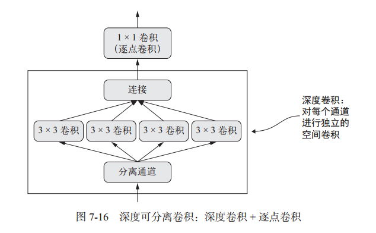

### 高级架构模式

#### 批标准化（keras 是 BatchNormalization）

工作原理：训练过程中在内部保存已读取每批数据均值和方差的指数移动平均值。
主要效果：有助于梯度传播，可以允许更深的网络，有些特别深的网络，只有多个 BatchNormalization 层才能进行训练

BatchNormalization 层通常在卷积层或密集连接层之后使用

BatchNormalization 有个 axis 参数：表示对哪个特征轴做标准化，默认为 -1，即输入张量的最后一个轴，`使用时保证通道在后`


```python
# 举例说明
from keras.layers import BatchNormalization, Conv2D, Dense
from keras.models import Sequential

conv_model = Sequential()
conv_model.add(Conv2D(32, 3, activation='relu'))
conv_model.add(BatchNormalization())

conv_model.add(Dense(32, activation='relu'))
conv_model.add(BatchNormalization())

```

#### 深度可分离卷积(SeparableConv2D 层)

对输入的每个通道分别执行空间卷积，然后通过逐点卷积（1×1 卷积）将输出通道混合。

相当于将空间特征学习和通道特征学习分开，如果你假设输入中的空间位置高度相关，但不同的通道之间相对独立，那么这么做是很有意义的。
此方法可以有使用较少的数据学到更好的表示，得到性能更好的模型




```python
from keras.layers import SeparableConv2D, MaxPooling2D, GlobalAveragePooling2D, Dense
from keras.models import Sequential

height = 64
width = 64
channels = 3
num_classes = 10

model = Sequential()
model.add(SeparableConv2D(32, 3, activation='relu',
                                 input_shape=(height, width, channels,)))
model.add(SeparableConv2D(64, 3, activation='relu'))
model.add(MaxPooling2D(2))


model.add(SeparableConv2D(64, 3, activation='relu'))
model.add(SeparableConv2D(128, 3, activation='relu'))
model.add(MaxPooling2D(2))

model.add(SeparableConv2D(64, 3, activation='relu'))
model.add(SeparableConv2D(128, 3, activation='relu'))
model.add(GlobalAveragePooling2D())

model.add(Dense(32, activation='relu'))
model.add(Dense(num_classes, activation='softmax'))
model.compile(optimizer='rmsprop', loss='categorical_crossentropy')
```

### 超参数优化
神经网络层数、神经单元或过滤器个数、激活函数的选择、是否在某层应用 BatchNormalization、Dropout 的比率等在架构层面的参数叫做超参数

超参数优化的过程通常如下所示。
- 选择一组超参数（自动选择）。
- 构建相应的模型。
- 将模型在训练数据上拟合，并衡量其在验证数据上的最终性能。
- 选择要尝试的下一组超参数（自动选择）。
- 重复上述过程。
- 最后，衡量模型在测试数据上的性能。

更新超参数的两个挑战：
- 计算反馈信号：确定一组超参数是否能够得到高性能的模型的计算成本很高
- 超参数空间是离散的，不能使用训练权重时使用梯度下降的方法

超参数优化的 Python 库：Hyperopt[英文](http://hyperopt.github.io/hyperopt/) [中文](https://zhuanlan.zhihu.com/p/32287147)、Hyperas

在进行大规模超参数自动优化时，需要时刻注意验证集的过拟合问题，因为你是使用验证数据计算出一个信号，然后根据这个信号更新超参数，所以你实际上
是在验证数据上训练超参数，很快会对验证数据过拟合。请始终记住这一点。『根据验证集的效果来训练超参数』

### 模型集成
训练不同的模型，将他们预测的结果进行集成

- 预测结果取平均值作为预测结果
```
preds_a = model_a.predict(x_val)
preds_b = model_b.predict(x_val)
preds_c = model_c.predict(x_val)
preds_d = model_d.predict(x_val)
final_preds = 0.25 * (preds_a + preds_b + preds_c + preds_d)
```

- 加权平均
其权重在验证数据上学习得到。通常来说，更好的分类器被赋予更大的权重，而较差的分类器则被赋予较小的权重。
```
preds_a = model_a.predict(x_val)
preds_b = model_b.predict(x_val)
preds_c = model_c.predict(x_val)
preds_d = model_d.predict(x_val)
final_preds = 0.5 * preds_a + 0.25 * preds_b + 0.1 * preds_c + 0.15 * preds_d # 这些权重是根据经验学到的
```


```python

```
